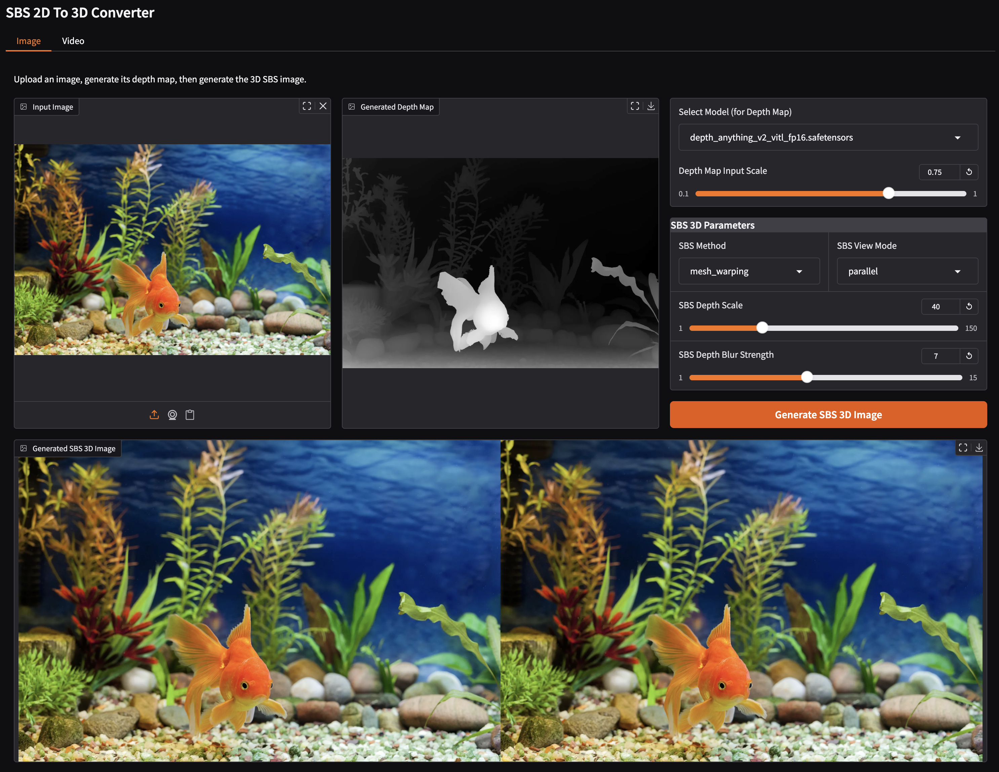

# SBS 2D-To-3D Converter

This is a standalone version of my original [ComfyUI SBS 2D-To-3D custom nodes](https://github.com/yushan777/ComfyUI-Y7-SBS-2Dto3D).

It will convert 2D images or videos into a simulated 3D side-by-side (SBS) format, viewable on compatible devices such as VR/AR headsets like Meta Quest, Apple Vision Pro, HTC Vive, or even those crappy cardboard ones.




This project utilizes the Depth Anything V2 model (safetensors formats)
Original [repository](https://github.com/DepthAnything/Depth-Anything-V2).

## Installation

Follow these steps to set up the project environment and install dependencies.

**1. Clone the Repository**

If you haven't already, clone the repository to your local machine:

```bash
git clone https://github.com/yushan777/SBS-2DTo3D.git
cd SBS-2DTo3D
```

**2. Create a Python Virtual Environment**

It's highly recommended to use a virtual environment to manage project dependencies.

```bash
python3 -m venv venv 
# Or python -m venv venv
```
*   This command creates a directory named `venv` in your project folder containing a dedicated Python installation.

**3. Activate the Virtual Environment**

You need to activate the environment before installing packages. The command differs based on your operating system:

*   **macOS / Linux (bash/zsh):**
    ```bash
    source venv/bin/activate
    ```
*   **Windows (Command Prompt):**
    ```bash
    venv\Scripts\activate.bat
    ```
*   **Windows (PowerShell):**
    ```bash
    venv\Scripts\Activate.ps1
    ```
    *(Note: You might need to adjust your PowerShell execution policy: `Set-ExecutionPolicy -ExecutionPolicy RemoteSigned -Scope Process`)*

    You'll know the environment is active when you see `(venv)` prepended to your command prompt.

**4. Install PyTorch (Hardware-Specific)**

Run the provided script to detect your hardware and install the correct PyTorch build (including `torchvision` and `torchaudio`):

```bash
python install_torch.py
```
*   This script checks for NVIDIA GPUs (installing the CUDA version if found) or Apple Silicon (installing the standard version with MPS support).

**5. Install Remaining Dependencies**

Install the other required packages listed in `requirements.txt`:

```bash
pip install -r requirements.txt
```

## Launch Gradio

```bash
python3 main.py

```


| **Parameter** | **Description** |
|---------------|-----------------|
| `Model` | Selects the Depth Anything V2 model for depth map generation. Different models (VITS (small), VITB (base), VITL (large)) offer trade-offs in speed and accuracy. If it does not exist, it will download the selected model into the directory `models/depthanything`. The default ...vitl-fp16 variant is approx 600MB. |
| `Depth Map Input Scale` | Downscales a copy of the image or video frame for generating the depth map. The original image or frame is unchanged. <br><br> At 100% (1.0), the depth map is generated at the same size as the input image or video frame. <br> Creating depth maps from large input images can be memory intensive. <br>Images larger than say, `1280×1280 (1.6MP)` should be downscaled before being passed to the depth estimation model. <br> When generating the SBS output, the generated depth map will then be scaled back up to match the original image's resolution. <br> Remember that depth maps are about relative distances, not fine details. This means that:<br><br>- Lower-resolution depth maps (like `512×512` or `1024×1024`) still preserve useful spatial information.<br>- Downscaling the input image before depth generation not only reduces VRAM usage, but when scaled back up, can also smooth the depth map — often improving the final 3D/parallax effect. |
| `SBS Method` | The algorithm used to generate the Side-by-Side 3D image from the depth map. <br> - mesh_warping: Warps the image based on a 3D mesh derived from the depth map. Generally provides good results. <br> - grid_sampling: Samples pixels from the original image based on a grid distorted by the depth map. Can be faster but might produce different visual artifacts. |
| `SBS View Mode` | Determines the arrangement of the left and right eye views in the SBS image. <br> - `parallel`: Left eye view on the left, right eye view on the right. Suitable for parallel viewing. <br> - `cross-eyed`: Right eye view on the left, left eye view on the right. Suitable for cross-eyed viewing. <br><br> - *Cross-eyed mode is primarily used for viewing stereoscopic 3D images on a regular 2D screen without needing any special equipment. <br> With Parallel, the left-eye image feeds the left eye, and the right-eye image feeds the right eye. <br> But with Cross-eyed, this is flipped it places the left-eye image on the right side and the right-eye image on the left side. <br> When you cross your eyes, each eye ends up looking at the correct image, and your brain fuses them into a 3D image which will appear centered. <br> If done correctly, that middle image will appear 3D without the need for a VR headset or 3D glasses.* |
| `SBS Depth Scale` | Controls the intensity of the 3D effect. Higher values increase the perceived depth and separation between foreground and background elements (for portraits, you may get very long, pointy noses at high values). Range: 1-150. |
| `SBS Depth Blur Strength` | Applies a blur to the depth map before SBS generation. This can help smooth out artifacts in the depth map and create a softer 3D effect. Must be an odd number. Range: 1-15. |
